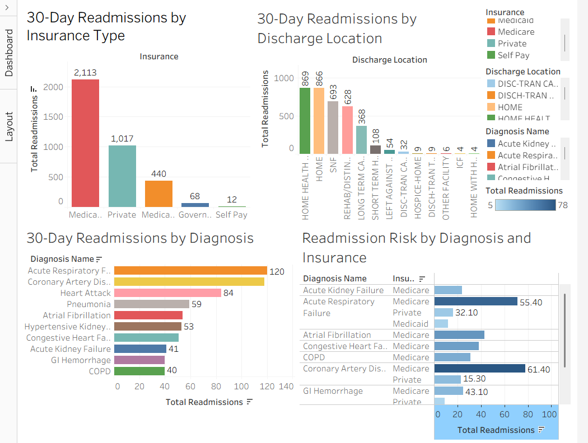

# hospital-readmission-risk-analysis
 Clinical data analysis of 30-day hospital readmission patterns using MIMIC-III clinical dataset — a real-world dataset containing over 40,000 ICU patient admissions from Beth Israel Deaconess Medical Center, Boston.
The goal is to identify key risk factors contributing to unplanned readmissions and produce actionable recommendations for hospital discharge planning teams.

## Background
Unplanned 30-day readmissions cost the US healthcare system over $26 billion annually. Hospitals face direct financial penalties from CMS for high readmission rates. This analysis approaches the problem from both a clinical and data perspective — combining pharmacy knowledge with health informatics methodology.

## Tools Used
SQL — data extraction and analysis
Excel — data cleaning and exploration
Tableau Public — interactive dashboard and visualization
GitHub — version control and portfolio

## Dataset
MIMIC-III Clinical Database — PhysioNet. Access requires CITI certification and credentialing approval.

## Project Status
🟡 In Progress — PhysioNet credentialing submitted April 27 2026. CITI certification completed. SQL environment configured. Practice queries written and tested. Awaiting MIMIC-III dataset access approval.
April 28 2026 — SQL practice completed. Core concepts mastered: SELECT, WHERE, GROUP BY, JOIN, HAVING, ORDER BY. Multi-table clinical readmission analysis queries written and tested.

## Progress Log

April 27 2026 — Project initiated. CITI certified. PhysioNet application submitted. GitHub repository created. SQL environment set up. Core query logic developed and tested
May 21 2026 — MIMIC-III access granted. Four tables imported. First real queries executed. Key finding: 6.87% 30-day readmission rate across 53,122 eligible patients. Medicare patients overrepresented at 57.89% of readmissions vs 48% of total admissions.
## Author
Ridham Patel · Masters in Health Informatics · University of Scranton

## Dashboard Preview

