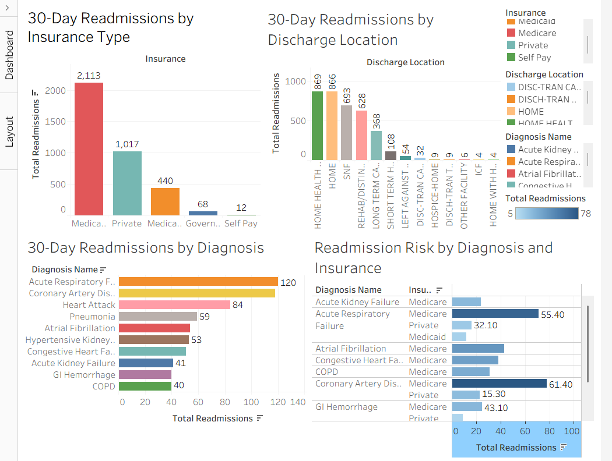

# Hospital 30-Day Readmission Risk Analysis

Clinical data analysis of 30-day hospital readmission patterns using the MIMIC-III clinical dataset — a real-world dataset containing 58,976 ICU patient admissions from Beth Israel Deaconess Medical Center, Boston.

## Dashboard Preview

## Interactive Dashboard (Python / Plotly)
Built with Python, Pandas, and Plotly — open `mimic_dashboard.html` in any browser for the full interactive version with hover details, headline metrics, and five chart panels.

**Charts included:**
- 30-Day Readmissions by Insurance Type
- 30-Day Readmissions by Discharge Location
- 30-Day Readmissions by Diagnosis (Top 10)
- Readmission Risk by Diagnosis and Insurance (Heatmap)
- Readmissions by Age Group

**Tools:** Python • Pandas • Plotly • SQL • Tableau

## Key Findings
- **6.37% overall 30-day readmission rate** — 3,384 readmissions out of 53,122 eligible admissions
- **Medicare patients disproportionately represented** — 57.74% of readmissions vs 45.76% of eligible admissions
- **HOME HEALTH CARE and HOME discharges account for 47.49% of readmissions** — pointing to gaps in post-discharge support
- **Highest-risk combination** — Acute Respiratory Failure + Medicare + SNF discharge — 30 cases averaging 11.0 days to readmission

## Clinical Recommendation
Implement pharmacist-led medication reconciliation calls at day 7 post-discharge for Medicare patients discharged home with cardiac or respiratory diagnoses. Average time-to-readmission clusters at 10–14 days across highest-risk groups — a day-7 call falls before that window closes.

## Case Study
A full written case study covering methodology, findings, and clinical recommendations is available in `readmission_case_study.pdf`.

## Predictive Model
A logistic regression model predicting 30-day readmission probability is in `predictive_model.py`.

## Background
Unplanned 30-day readmissions cost the US healthcare system over $26 billion annually. Hospitals face direct financial penalties from CMS for high readmission rates. This analysis approaches the problem from both a clinical and data perspective — combining pharmacy knowledge with health informatics methodology.

## Tools Used
- SQL (DB Browser for SQLite) — data extraction and analysis
- Python (Pandas, Plotly, scikit-learn) — dashboard and predictive model
- Microsoft Excel — data cleaning and exploration
- Tableau Public — interactive dashboard
- GitHub — version control and portfolio

## Dataset
MIMIC-III Clinical Database — PhysioNet. Access requires CITI certification and credentialing approval.

## Methodology
Readmission defined using SQL LEAD() window function to pair each admission with its next chronological admission — avoiding double-counting that affects self-join methodologies.

## Limitations & Future Work
- MIMIC-III is single-institution ICU data from Beth Israel Deaconess Medical Center, Boston — findings may not generalize to other hospital systems
- Readmission definition captures any return visit, not only unplanned clinical readmissions
- Future work: ICD-10 diagnosis grouping, length of stay by age group analysis, expanded predictive model with clinical features, external validation dataset

## Project Status
🟢 Analysis Complete

## Progress Log
- **April 27, 2026** — Project initiated. CITI certified. PhysioNet application submitted. GitHub repository created. SQL environment set up.
- **April 28, 2026** — SQL practice completed. Core concepts mastered: SELECT, WHERE, GROUP BY, JOIN, HAVING, ORDER BY.
- **May 21, 2026** — MIMIC-III access granted. Four tables imported. First real queries executed.
- **July 15, 2026** — Corrected readmission methodology using LEAD() window functions. Corrected rate: 6.37% (3,384 readmissions / 53,122 eligible admissions).
- **September 2026** — Added Python/Plotly interactive dashboard, age group analysis, logistic regression predictive model, and written case study.

## Author
Ridham Patel · MS Health Informatics, Data Analytics Specialization · University of Scranton
BPharm — CHARUSAT University · github.com/ridham0065 · patelridham0701@gmail.com
